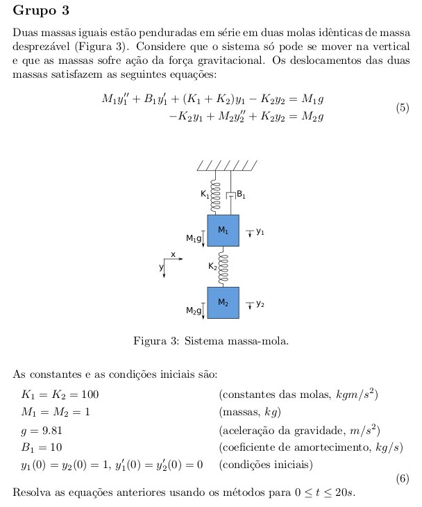

# final-metodos2
## Descrição do projeto
Resolver problemas de valor incial aplicado a um sistema massa-mola.
Sendo necessário implementação, relatório e apresentação.

<!-- Gambiarra para centralizar a imagem -->

Os métodos usados serão:

* Euler: forward, modificado e backward;
* Runge-Kutta: segunda, terceira e quarta ordem;
* Preditor-Corretor de Adams: terceira e quarta ordem.

## Implementação
Esta implementação em particular vai ser feita em C++.

## Relatório
O relatório contém a descrição do problema tratado, a descrição do que cada membro da equipe fez e a análise dos resultados que compare o tempo e a estabilidade dos diferentes métodos.

## Apresentação
A apresentação deve cobrir os mesmos tópicos do relatório e uma demonstração da implementação.
