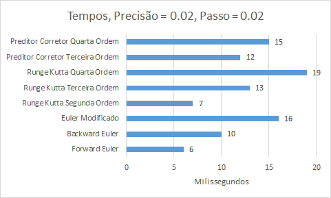

#Trabalho de Métodos Numéricos II - Relatório
|Nome               |Matrícula|
|-------------------|---------|
|Carolina Herbster  | 354044  |
|Daniel Augusto     | 354047  |
|Heitor Oliveira    | 354065  |
|Mariana Fontenele  | 354081  |

## Introdução
O trabalho tem como objetivo aplicar conhecimentos adquiridos na cadeira de
Métodos Numéricos II. Assim, cada equipe recebe um problema de valor inicial e
deve resolvê-lo implementando os métodos seguintes em C++:

* Euler: forward, modificado e backward;
* Runge-Kutta: segunda, terceira e quarta ordem;
* Preditor-Corretor de Adams: terceira e quarta ordem.

## Problema proposto

Trata-se de um problema num sistema massa-mola em que o movimento das massas é
definido por duas equações diferenciais ordinárias de segunda ordem. Contudo,
os métodos estudados na disciplina só resolvem EDOs de primeira ordem, então
teve que ser feito uma adaptação no sistema, transformando ele de duas EDOs de
segunda ordem em quatro de primeira ordem.

## Implementação

A implementação dos métodos numéricos foi feita em C++11, contudo, para resolver
sistemas lineares de EDOs precisaríamos de algumas classes envolvendo vetores e
matrizes. Felizmente, na disciplina de [Métodos Numéricos I][m1] já tínhamos
classes que representam essas estruturas e estas classes foram importadas com
leves modificações neste projeto.

Para organizar o trabalho em equipe, usamos a plataforma [Github][m2] e a
ferramenta de controle de versão [Git][git]. Isso facilitou muito o trabalho
concorrente de membros da equipe. Outra ferramenta que ajudou muito a
implementação foi a biblioteca [Catch][cth] que fornece uma interface simples
para a implementação de testes unitários, usando ela certos bugs foram
detectados mais cedo e de forma automatizada.

Sobre a estrutura das classes do trabalho, estamos representando cada método
como uma classe que herda de uma classe abstrata que indica o que um método
precisa ter e implementar. No caso, ela precisa ter a matriz que representa o
sistema linear, o valor do passo, um valor corrente e uma função que transforma
o valor corrente no próximo.

Ou seja, os métodos são "iteradores" que alteram seu estado a cada passo.
Já que essa interface é muito baixo-nível, foram criadas funções auxiliares
para o usuário comum usar. A interface de mais alto nível é uma função que
recebe um método e um valor para qual queremos avaliar a solução do sistema,
retornando o valor da solução naquele ponto.

[m1]: https://github.com/danisson/final-metodos1 "Github do projeto anterior"
[m2]: https://github.com/danisson/final-metodos2 "Github do projeto atual"
[git]: http://en.wikipedia.org/wiki/Git_%28software%29 "Página do Wikipédia sobre git"
[cth]: https://github.com/philsquared/Catch "Github da biblioteca Catch"

## Visualização

Como foi altamente recomendado a existência uma simulação que demonstrasse o
movimento do sistema, uma simulação foi implementada em Python2 utilizando a
biblioteca [PyGame][pg].

Já que estamos simulando um sistema físico resolvemos adicionar como parâmetro
da animação o tempo que ela deveria rodar, isso acabou incluindo um problema
porque dependendo do *passo* do método teríamos muitos frames para poucos
segundos. Por exemplo, usando um passo de 0.01 temos cerca de 2000 frames, isso
é uma animação de 33.3 segundos supondo 60fps.

Por causa disso, estamos usando um método simples de *frame skipping*, ou seja,
estamos pulando uma certa quantidade de frames para não ultrapassar a marca de
60 frames por segundo. A vantagem de usar isso é que estamos potencialmente
evitando problemas de *screen tearing* na maior parte dos monitores e mostrando
a animação muito próximo do tempo que foi especificado. (A custa de não exibir
certos frames)

[pg]: http://en.wikipedia.org/wiki/Pygame "Página do Wikipédia sobre Pygame"

##Resultados e Análise
Para fazer a análise, rodamos os métodos em turnos. Cada turno aumentava a
precisão requerida em fatores de 10, assim estavamos crescendo a precisão de
forma exponencial.

Como podemos ver no gráfico, em todos os métodos aconteceu um crescimento
exponencial do tempo de espera. Sendo que o maior deles foi gasto pelo
Range-Kutta de quarta ordem e o menor pelo método de Euler.

Aqui temos uma comparação de tempo usando passo com valor de 0.02. Aqui temos que
os métodos mais rápidos foram Forward Euler e Range-Kutta de Segunda Ordem.
Vamos agora comparar os valores computados pelos dois.

Podemos ver que que o Método de Runge-Kutta tem resultados muito mais suaves com
uma precisão baixa e no mesmo tempo que o método de Euler.

Todos os outros métodos convergem e retornam valores na mesma ordem aparti
desse valor de passo. Mas é interessante que nesta precisão, os métodos mais
sofisticados tem diferenças de no máximo o passo.

Este gráfico mostra isso comparando o Preditor-Corretor de quarta ordem com o
Range-Kutta de quarta ordem, está sendo mostrado a diferenção entre eles.

Também observamos que quando o passo é 0.1, a maioria dos métodos diverge.

Backward Euler foi o método que mais demorou porque ele foi o método que mais 
divergiu.

Daqui, podemos ver que a maior parte dos métodos divergiram, exceto Range-Kutta
de terceira e de quarta ordem. Podemos explicar isso porque estes métodos
avaliam a equação diferencial em frações do passo enquanto que os outros só
avaliam em quantidades inteiras de passo. O gráfico do método de Euler Backward
não pode ser mostrado porque depois do segundo passo, todos os valores ficaram
em -infinito, isso acontece porque o ponto-fixo também divergiu.

Concluindo a análise, podemos ver que o método de Range-Kutta 4 é o mais preciso
nos valores variados de passo mas também é o mais lento.

##Divisão do trabalho
| Membro da Equipe          | Parte do trabalho                                                             |
|:--------------------------|:------------------------------------------------------------------------------|
| Carolina Herbster         | Implementação do método Euler backward                                        |
|                           | Implementação do método de Runge-Kutta de quarta ordem                        |
|                           | Implementação do método Preditor-Corretor de Adams de terceira e quarta ordem |
|                           | Implementação da visualização                                                 |
|                           | Implementação do menu                                                         |
| Daniel Augusto Ramos      | Implementação do método Euler forward                                         |
|                           | Implementação do método de Runge-Kutta de terceira ordem                      |
|                           | Escrita do Relatório                                                          |
|                           | Correção de bugs                                                              |
| Heitor Oliveira           | Implementação do método Runge-Kutta de segunda ordem                          |
|                           | Implementação da visualização                                                 |
| Mariana Fontenele Lopes   | Implementação do método Euler modificado                                      |
|                           | Escrita do Relatório                                                          |